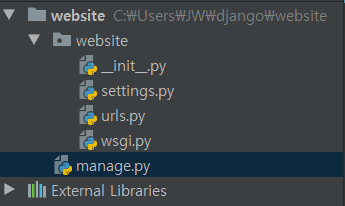

http://raccoonyy.github.io/django-2-0-release-note-summary/


인강은 1.9 버전으로 진행되었고 저는 2.0버전을 사용했기 때문에 다소 다른점이 있을 수도 있습니다. 

제가 개인적으로 덧 붙였던 내용입니다. 


파이썬 프로젝트 생성

```
django-admin startproject website
```


파이참과 같은 IDE로 열어보면 



와 같이 프로젝트가 생성되어 있다.

`manage.py`는 건들이지말것!!!!!!

`setting.py`설정을 관리하는파일

`urls.py` 웹사이트 만들때 라우팅을 해주는 파일

ex) 우편 배달부가 어디로 우편을 보내야 하는지 적어놓은 곳이다.

 `wsgl.py` 나중에배움


# 서버실행시키기

콘솔창에 가서 실행시킨다. 

`python manage.py runserver`

각자 사용하는 인터넷 브라우저에서 

`127.0.0.1:8000`


App이란 프로그램으로써 실행 될 수 있는 최소단위 

(한줄로 요약할수 있으면 된다.)


`python manage.py startapp music` music 이라는 app이 생긴것이다.

모든 app은 database와 연결되어 있음.


`models.py` 는 데이터 베이스의 청사진이다. 나중에 이것을 토대로 데이터베이스가만들어진다.

`apps.py`이 어플리케이션을 위한 설정파일 `settings.py`와 같다.

`views.py`는 파이썬에서 function을 담당한다.  사용자로부터 데이터를 받고 가공하여 다시돌려주는 그런역할을 한다 (controller)


기본적인 원리는 편지(HTML문서)를 주고받는 것과 같다. 보통 편지를 쓰면 우표가 있어야 하고 받는사람 이름이있어야하고 주소가있어야하고 하는식의 정해진 양식에 따라야 한다. 이것을 HTTP라고 한다.  

우편배달부가 편지를 받으면 어디에 보내는지 주소를 보고 찾아야하는데 이것을 라우팅이라고 한다. 

편지를 쓰면 편지를 우체통에 넣고 우편배달부가 관할 우체국으로 보낸다. 그리고 관할 우체국에서 받는 사람의 관할 우체국으로 보내고, 관할 우체국의 우편배달부가 받는사람에게 편지를 전달한다. 이렇게 편지를 주고 받으면서 하는 것이 통신의 원리는 매우 흡사하다. 

django에서는 urls.py 에서 라우팅을 해주고 쉽게 표현하면 우편 배달부가 편지를 어디에 전달해야할지 알려준다고 보면 된다.

`views.py`에서는 답장을 해준다고 생각하면 된다. 우리가 편지를 받았고 그 편지에 답장을 어떻게 보낼지 정해준다고 생각하면된다. 


```
언제 include() 를 사용해야 하나요?

admin.site.urls 를 제외한, 다른 URL 패턴을 include 할 때마다 항상 include() 를 사용해야 합니다.
```


